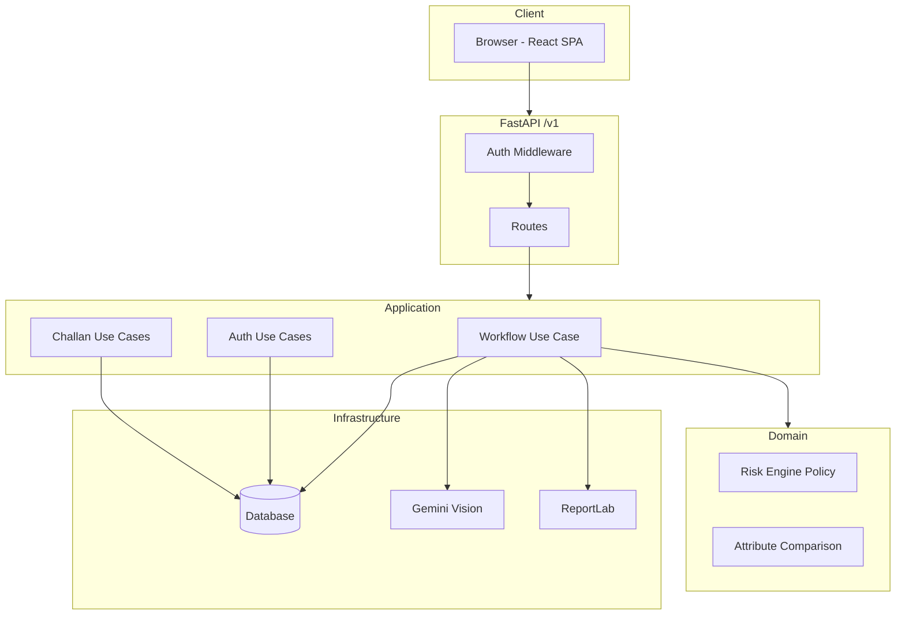
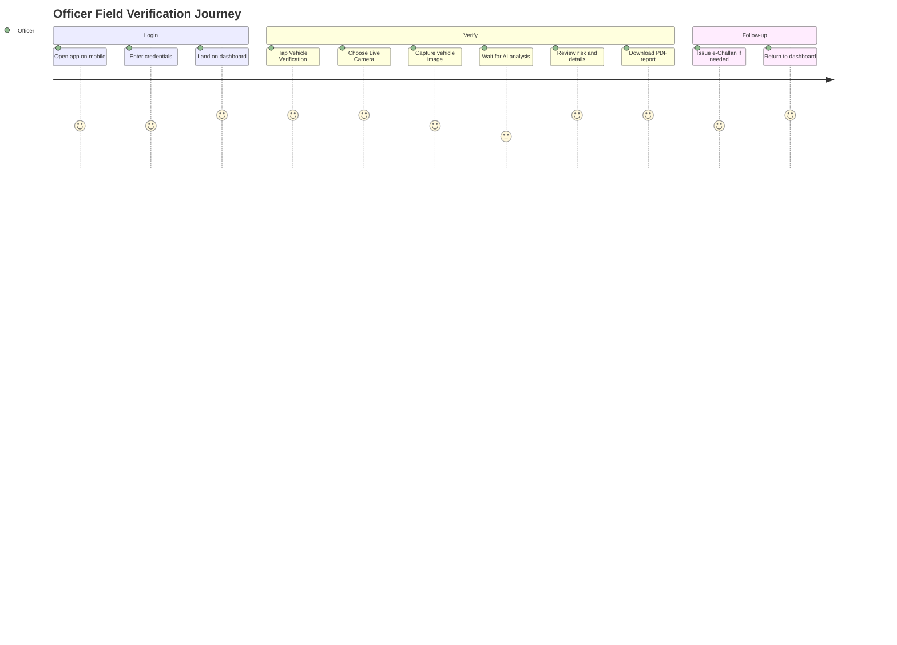
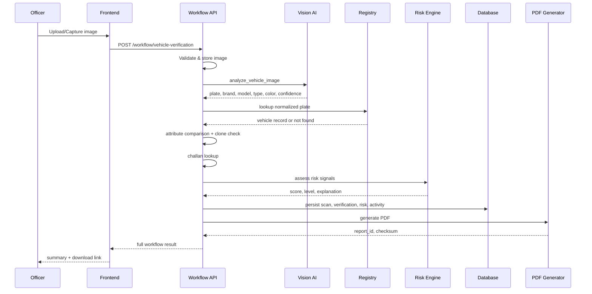

# Product Requirements Document

# SentinelANPR AI
## AI-Powered Smart Vehicle Verification & Digital Investigation Platform

| Field | Value |
|-------|-------|
| **Product Name** | SentinelANPR AI |
| **Version** | 2.0 (Enterprise) |
| **Document Type** | Product Requirements Document (PRD) |
| **Status** | Approved for Implementation |
| **Classification** | Official — Law Enforcement Technology |
| **Issuing Authority** | Prakasam District Police Department |
| **Document Owner** | Product Management & Enterprise Architecture |
| **Primary AI Provider** | Google Gemini Vision API (`gemini-2.5-flash` or successor) |
| **Architecture Standard** | Clean Architecture · Hexagonal · Domain-Driven Design |
| **Effective Date** | 2026-07-10 |
| **Review Cycle** | Quarterly |

---

## Document Control

| Version | Date | Author | Summary |
|---------|------|--------|---------|
| 1.0 | 2026-Q2 | Architecture Board | Foundation PRD — YOLO/OCR pipeline design |
| 1.5 | 2026-Q2 | Product + Engineering | Migration to multimodal Vision AI |
| **2.0** | **2026-07-10** | **PM + Chief Architect** | **Enterprise PRD — full government delivery specification** |

**Distribution List:** Commissioner of Police · IT Directorate · Cyber Crime Unit · Traffic Enforcement · Station Commanders · Software Engineering · QA · Security Audit · Legal & Compliance

**Approval Signatures (Placeholder)**

| Role | Name | Date | Signature |
|------|------|------|-----------|
| Product Owner | _________________ | ________ | ________ |
| Police Domain Sponsor | _________________ | ________ | ________ |
| Chief Software Architect | _________________ | ________ | ________ |
| Information Security Officer | _________________ | ________ | ________ |

---

## Table of Contents

1. [Executive Summary](#1-executive-summary)
2. [Vision Statement](#2-vision-statement)
3. [Business Objectives](#3-business-objectives)
4. [Problem Statement](#4-problem-statement)
5. [Goals](#5-goals)
6. [Scope](#6-scope)
7. [Stakeholders](#7-stakeholders)
8. [User Personas](#8-user-personas)
9. [Functional Requirements](#9-functional-requirements)
10. [Non-Functional Requirements](#10-non-functional-requirements)
11. [Architecture Overview](#11-architecture-overview)
12. [System Modules](#12-system-modules)
13. [User Journey](#13-user-journey)
14. [Vehicle Verification Workflow](#14-vehicle-verification-workflow)
15. [Vision AI Workflow](#15-vision-ai-workflow)
16. [Live Camera Workflow](#16-live-camera-workflow)
17. [Investigation Workflow](#17-investigation-workflow)
18. [Risk Assessment Workflow](#18-risk-assessment-workflow)
19. [Clone Detection Workflow](#19-clone-detection-workflow)
20. [Manual Review Workflow](#20-manual-review-workflow)
21. [e-Challan Workflow](#21-e-challan-workflow)
22. [Reports Module](#22-reports-module)
23. [Analytics Module](#23-analytics-module)
24. [Watchlist Module](#24-watchlist-module)
25. [Case Management Module](#25-case-management-module)
26. [Notification Module](#26-notification-module)
27. [Profile Module](#27-profile-module)
28. [Management Module](#28-management-module)
29. [Security Requirements](#29-security-requirements)
30. [Database Design](#30-database-design)
31. [API Requirements](#31-api-requirements)
32. [UI Requirements](#32-ui-requirements)
33. [Mobile Responsiveness](#33-mobile-responsiveness)
34. [Role Based Access Control](#34-role-based-access-control)
35. [Error Handling](#35-error-handling)
36. [Logging](#36-logging)
37. [Monitoring](#37-monitoring)
38. [Deployment](#38-deployment)
39. [Testing Strategy](#39-testing-strategy)
40. [Acceptance Criteria](#40-acceptance-criteria)
41. [Future Enhancements](#41-future-enhancements)
42. [Risks](#42-risks)
43. [Assumptions](#43-assumptions)
44. [Dependencies](#44-dependencies)
45. [Appendix](#45-appendix)

---

# 1. Executive Summary

## 1.1 Purpose of This Document

This Product Requirements Document (PRD) defines the complete functional, non-functional, architectural, security, and operational requirements for **SentinelANPR AI Version 2.0**, an enterprise web platform commissioned for delivery to the **Prakasam District Police Department** and extensible to statewide law enforcement deployment.

This document is the authoritative specification for engineering, quality assurance, security audit, procurement, training, and acceptance testing. All design decisions, sprint planning, and change requests shall trace to requirement identifiers defined herein.

## 1.2 Product Summary

**SentinelANPR AI** is a browser-based command center that enables authorized police personnel to:

1. Capture or upload a vehicle photograph from the field or checkpoint.
2. Analyze the image using **multimodal Vision AI** (Google Gemini) to extract registration number, brand, model, type, color, confidence, and reasoning.
3. Verify extracted data against the **government vehicle registry**.
4. Detect clone vehicles, watchlist matches, attribute mismatches, and outstanding traffic violations.
5. Score risk using a **deterministic, policy-versioned risk engine**.
6. Route low-confidence or high-risk outcomes to **manual officer review** when required.
7. Persist a tamper-evident **digital investigation** with SHA-256 hash chaining.
8. Generate **PDF investigation reports** and export operational data (PDF, CSV, Excel).
9. Manage **e-Challans**, **cases**, **watchlists**, **users**, **stations**, **analytics**, and **notifications** under strict **role-based access control (RBAC)** with **station data isolation**.

## 1.3 Strategic Context

Traditional ANPR systems chain object detection, OCR, and manual registry lookup across disconnected tools. Field conditions in India—mobile phone captures, glare, night imagery, angled plates, and partial occlusion—cause cascading failures in multi-stage pipelines.

Version 2.0 replaces fragmented ML chains with a **single multimodal Vision AI stage** feeding **pure domain policies** for verification, clone detection, and risk scoring. The platform is engineered under **Clean Architecture** so AI providers, registries, and storage backends remain replaceable without rewriting business rules.

## 1.4 Target Deployment

| Environment | Purpose |
|-------------|---------|
| Development | Engineering iteration with stub Vision AI |
| Staging | UAT, security testing, load testing |
| Production | Live police operations with Gemini Vision and production registry |

## 1.5 Delivery Milestones

| Milestone | Description | Target |
|-----------|-------------|--------|
| M1 — Core Platform | Auth, RBAC, verification workflow, reports, history | Phase 1 |
| M2 — Operations | Management, analytics, e-Challan, notifications | Phase 2 |
| M3 — Intelligence | Watchlist, case management, clone detection, manual review | Phase 3 |
| M4 — Enterprise Hardening | Audit logs, hash chaining, monitoring, HA deployment | Phase 4 |

## 1.6 Key Success Metrics

| Metric | Target |
|--------|--------|
| End-to-end verification (upload to report) | ≤ 30 seconds (P95, excluding manual review) |
| Vision AI registration extraction accuracy | ≥ 92% on approved test set |
| System availability (production) | ≥ 99.5% monthly |
| Officer task completion without training escalation | ≥ 90% within first session |
| Investigation audit completeness | 100% of verifications logged with officer, timestamp, station |
| Report integrity verification | 100% of PDFs verifiable via SHA-256 chain |

---

# 2. Vision Statement

## 2.1 Vision

> **Empower every authorized officer to convert a single vehicle image into a defensible, tamper-evident digital investigation—in seconds—using trustworthy AI, rigorous engineering, and police-grade accountability.**

## 2.2 Mission

To provide Prakasam District Police with a unified, secure, and scalable platform that accelerates vehicle identity verification, reduces clone and fraud risk, digitizes investigation evidence, and integrates traffic enforcement (e-Challan) within one operational command center.

## 2.3 Design Principles

| Principle | Description |
|-----------|-------------|
| **Officer-first** | Minimal steps from capture to decision; mobile-optimized |
| **Defensible evidence** | Tamper-evident reports, audit trails, officer attribution |
| **Policy over prompts** | AI extracts; software decides via versioned domain policies |
| **Least privilege** | RBAC + station isolation on every read and write |
| **Replaceable adapters** | Vision AI, registry, storage, and notification providers swappable |
| **Transparency** | Confidence scores, AI explanations, and risk signal breakdowns shown to officers |
| **Operational continuity** | Graceful degradation when Vision AI or registry is unavailable |

## 2.4 North-Star User Experience

An officer at a checkpoint opens SentinelANPR AI on a mobile browser, taps **Live Camera**, captures a vehicle image, and within seconds reviews registration details, registry match status, risk level, outstanding challans, and watchlist alerts. The officer downloads a PDF report, optionally opens a case, or issues an e-Challan—all without leaving the platform. A station administrator later reviews analytics, officer performance, and pending manual reviews from the same system.

---

# 3. Business Objectives

## 3.1 Primary Objectives

| ID | Objective | Measurable Outcome |
|----|-----------|-------------------|
| BO-01 | Reduce vehicle verification time at checkpoints | 70% reduction vs manual multi-tool process |
| BO-02 | Increase detection of suspicious/cloned vehicles | Measurable via risk engine HIGH/CRITICAL rate and confirmed cases |
| BO-03 | Digitize investigation evidence | 100% of verifications produce storable PDF + database record |
| BO-04 | Centralize traffic violation management | e-Challan issuance and tracking within platform |
| BO-05 | Enable data-driven policing | Dashboards for station and department leadership |
| BO-06 | Enforce accountability | Every action attributed to authenticated officer with audit log |
| BO-07 | Support scalable statewide rollout | Architecture supports multi-district deployment |

## 3.2 Secondary Objectives

| ID | Objective |
|----|-----------|
| BO-08 | Reduce duplicate data entry across stations |
| BO-09 | Standardize investigation report format for court admissibility |
| BO-10 | Provide watchlist-driven proactive alerts |
| BO-11 | Link investigations to formal case records |
| BO-12 | Integrate with future national registry APIs (VAHAN/e-Challan national systems) |

## 3.3 Key Performance Indicators (KPIs)

| KPI | Formula | Reporting Frequency |
|-----|---------|-------------------|
| Daily verifications | Count of completed workflows | Daily |
| High-risk detection rate | HIGH+CRITICAL / total verifications | Weekly |
| Manual review backlog | Pending reviews count | Daily |
| e-Challan collection rate | Paid fines / issued fines | Monthly |
| Officer adoption | Active officers / total licensed officers | Monthly |
| Mean time to report | Avg( report_generated_at - scan_started_at ) | Weekly |
| Watchlist hit rate | Watchlist matches / total verifications | Weekly |

---

# 4. Problem Statement

## 4.1 Operational Reality

Police officers at traffic checkpoints, highway patrols, crime scenes, and parking enforcement must rapidly determine:

- Is the registration plate valid and registered?
- Does the physical vehicle match registry attributes (color, type, brand, model)?
- Is this a clone vehicle or stolen registration?
- Are there outstanding traffic violations (challans)?
- Is this vehicle on a watchlist (stolen, wanted, suspicious)?

Today, answering these questions requires **multiple disconnected systems**, manual comparison, and paper or ad-hoc digital notes—creating delays, errors, and weak audit trails.

## 4.2 Pain Points

| Pain Point | Impact on Operations |
|------------|---------------------|
| Tool fragmentation | Officers switch between camera apps, ANPR tools, registry portals, and paper forms |
| Legacy ANPR fragility | YOLO→OCR chains fail on mobile imagery, glare, and angled plates |
| No unified risk scoring | Officers rely on intuition; inconsistent escalation |
| Weak evidence trail | Difficult to defend actions in court or internal review |
| No station-scoped administration | Central IT burden for every officer change |
| Paper challans | Lost records, reconciliation delays, revenue leakage |
| No watchlist integration at point of verification | Missed proactive interceptions |
| No formal case linkage | Investigations scattered across reports without case lifecycle |

## 4.3 Formal Problem Statement

**Police officers and administrators lack a unified, secure, AI-assisted platform that transforms a single vehicle photograph into a complete, auditable, tamper-evident investigation outcome—including registry verification, risk assessment, watchlist matching, challan status, case linkage, and exportable reports—while enforcing role-based and station-based data isolation.**

## 4.4 Opportunity

Multimodal Vision AI can jointly extract plate text and visual vehicle attributes from a single image. When combined with deterministic domain policies, government registry data, and tamper-evident reporting, this enables a **step-change in field verification speed and accountability** suitable for district pilot and statewide scale.

---

# 5. Goals

## 5.1 Product Goals

| ID | Goal |
|----|------|
| G-01 | Deliver one-step vehicle verification from image to investigation report |
| G-02 | Support both image upload and live browser camera capture |
| G-03 | Integrate government vehicle registry verification |
| G-04 | Provide policy-versioned risk assessment with explainable signals |
| G-05 | Enable watchlist matching and clone detection |
| G-06 | Support manual review queue for low-confidence outcomes |
| G-07 | Generate tamper-evident PDF reports with SHA-256 hash chaining |
| G-08 | Provide role-scoped dashboards and analytics |
| G-09 | Deliver full e-Challan lifecycle management |
| G-10 | Support formal case management linked to investigations |
| G-11 | Enforce JWT authentication and three-tier RBAC |
| G-12 | Deliver mobile-responsive UI for field officers |
| G-13 | Maintain Clean Architecture for long-term maintainability |

## 5.2 Non-Goals (v2.0)

| ID | Excluded Item | Rationale |
|----|---------------|-----------|
| NG-01 | Live CCTV multi-camera grid ingestion | Roadmap — separate ingestion subsystem |
| NG-02 | Facial recognition | Legal and scope boundary |
| NG-03 | Automatic FIR filing | Requires legal workflow integration |
| NG-04 | Drone feed ingestion | Roadmap |
| NG-05 | Native offline mobile SDK | v2.0 is responsive web; native SDK is future |
| NG-06 | Public citizen portal | Internal police system only |

---

# 6. Scope

## 6.1 In Scope

### 6.1.1 Authentication & Authorization
- Officer login with JWT access and refresh tokens
- Role-based access control (SUPER_ADMIN, STATION_ADMIN, POLICE_OFFICER)
- Permission-scoped API and UI access
- Station data isolation
- Temporary password issuance with forced password change
- Logout and session invalidation

### 6.1.2 Management
- Police station CRUD (super admin)
- User/officer CRUD with human-readable IDs (AP-26-XX, ADMIN001, STA001, OFF001)
- Station-scoped officer management (station admin)
- Credential reset and lifecycle (activate/deactivate/soft delete)

### 6.1.3 Vehicle Verification
- Image upload verification
- Live camera capture verification
- Multimodal Vision AI analysis
- Registry verification
- Attribute comparison
- Clone detection
- Outstanding challan lookup
- Risk assessment
- Manual review routing
- Investigation persistence
- PDF report generation

### 6.1.4 Investigation & Case Management
- Investigation history (role-scoped)
- Formal case creation, assignment, status, timeline, evidence linking
- Watchlist management and matching

### 6.1.5 Reports & Analytics
- Investigation reports (PDF, CSV, Excel)
- Officer, station, department, vehicle, and e-Challan reports
- Executive dashboard with KPIs and charts
- Analytics module with filters and exports

### 6.1.6 e-Challan
- Violation master
- Vehicle search
- Challan issuance, pending, paid, cancelled
- Challan PDF generation
- Challan analytics and revenue reporting

### 6.1.7 Notifications
- Real-time and near-real-time alerts for investigations, watchlist, clone, e-Challan

### 6.1.8 Profile
- Profile view and update
- Password change
- Profile photo (per policy)

### 6.1.9 Security & Compliance
- Password hashing (bcrypt)
- Audit logging
- Tamper-evident reports (SHA-256 hash chaining)
- Input validation and file upload security

### 6.1.10 Mobile & Responsiveness
- Responsive UI for 320px–desktop breakpoints
- Touch-optimized controls (44px minimum touch targets)
- Mobile camera support

## 6.2 Out of Scope (v2.0 Release)

- National VAHAN live API (adapter interface defined; demo registry in v2.0)
- Biometric authentication
- Blockchain anchoring (SHA-256 chaining in-scope; external anchoring out-of-scope)
- Multi-language UI (English primary; i18n framework roadmap)
- Hardware ANPR camera direct integration

## 6.3 Phase Mapping

| Phase | Modules |
|-------|---------|
| Phase 1 (MVP) | Auth, RBAC, Verification, Reports, History, Dashboard |
| Phase 2 | Management, e-Challan, Analytics, Notifications, Profile |
| Phase 3 | Watchlist, Cases, Clone Detection, Manual Review |
| Phase 4 | Enterprise audit, hash chaining, HA deployment, monitoring |

---

# 7. Stakeholders

## 7.1 Primary Stakeholders

| Stakeholder | Role | Interest |
|-------------|------|----------|
| Commissioner of Police | Executive sponsor | Strategic outcomes, budget, statewide rollout |
| District SP / Commanders | Operational sponsor | Adoption, KPIs, station performance |
| Station House Officers (SHO) | Station admin users | Officer management, station investigations |
| Police Officers (Constable–Inspector) | End users | Fast field verification |
| Traffic Enforcement Unit | e-Challan operators | Violation issuance and collection |
| Cyber Crime / Special Branch | Intelligence users | Watchlist, clone alerts, case evidence |
| IT Directorate | Technical owner | Hosting, integration, support |
| Legal & Prosecution | Compliance | Report admissibility, audit trail |

## 7.2 Secondary Stakeholders

| Stakeholder | Interest |
|-------------|----------|
| Finance / Revenue | e-Challan collection reporting |
| Training Academy | Officer onboarding materials |
| Citizens (indirect) | Faster, fairer enforcement |
| Vendor (Gemini/Google) | API availability and SLAs |
| State NIC / Registry Authority | Future VAHAN integration |

## 7.3 RACI Matrix (Summary)

| Activity | Police Sponsor | Product Owner | Engineering | Security | QA |
|----------|:--------------:|:-------------:|:-----------:|:--------:|:--:|
| Requirements approval | A | R | C | C | I |
| Architecture sign-off | I | A | R | C | I |
| UAT execution | R | C | I | I | A |
| Production go-live | A | R | R | C | C |
| Security audit | I | C | C | A | C |

*R = Responsible, A = Accountable, C = Consulted, I = Informed*

---

# 8. User Personas

## 8.1 Persona 1 — Rajesh Kumar, Police Officer (Field)

| Attribute | Detail |
|-----------|--------|
| **Role** | POLICE_OFFICER |
| **Rank** | Police Constable |
| **Age** | 28 |
| **Tech comfort** | Moderate — uses WhatsApp, basic apps |
| **Device** | Android smartphone, occasional station desktop |
| **Goals** | Verify vehicles quickly at checkpoints; issue challans; download proof |
| **Frustrations** | Slow registry lookup; unclear when to escalate; paper challans |
| **Success** | Capture photo → see clear risk badge → download PDF in under 30 seconds |

## 8.2 Persona 2 — Priya Reddy, Station Administrator

| Attribute | Detail |
|-----------|--------|
| **Role** | STATION_ADMIN |
| **Rank** | Sub-Inspector / SHO |
| **Age** | 38 |
| **Device** | Desktop primary, tablet secondary |
| **Goals** | Manage station officers; review station investigations; monitor performance |
| **Frustrations** | No visibility into officer activity; manual roster management |
| **Success** | Dashboard shows station KPIs; create officer with temp password in 2 minutes |

## 8.3 Persona 3 — Dr. Anand Rao, Super Administrator

| Attribute | Detail |
|-----------|--------|
| **Role** | SUPER_ADMIN |
| **Rank** | Deputy Commissioner / IT-led admin |
| **Age** | 45 |
| **Device** | Desktop |
| **Goals** | Department-wide oversight; user/station management; analytics; policy compliance |
| **Frustrations** | Fragmented systems; no department-wide risk view |
| **Success** | Executive dashboard; export reports; manage all stations from one console |

## 8.4 Persona 4 — Suresh Naidu, Traffic Enforcement Officer

| Attribute | Detail |
|-----------|--------|
| **Role** | POLICE_OFFICER (with challans permission) |
| **Goals** | Search vehicle, check outstanding fines, issue e-Challan with PDF |
| **Success** | Issue challan linked to verification in one workflow |

## 8.5 Persona 5 — Cyber Crime Analyst

| Attribute | Detail |
|-----------|--------|
| **Role** | SUPER_ADMIN or specialized analyst (future role) |
| **Goals** | Maintain watchlists; review clone alerts; open cases |
| **Success** | Watchlist hit triggers notification; case created from investigation |

---

# 9. Functional Requirements

All functional requirements use the identifier format **FR-&lt;MODULE&gt;-&lt;NNN&gt;**. Priority: **P0** (must-have for go-live), **P1** (required for full v2.0), **P2** (enhancement).

## 9.1 Authentication (AUTH)

| ID | Requirement | Priority | Acceptance |
|----|-------------|----------|------------|
| FR-AUTH-001 | System shall provide a secure login page for authorized personnel only | P0 | Unauthenticated users cannot access `/app/*` |
| FR-AUTH-002 | Login shall accept identifier (username, badge number, or email) and password | P0 | All three identifier types authenticate |
| FR-AUTH-003 | System shall issue JWT access token (Bearer) on successful login | P0 | Token returned in login response |
| FR-AUTH-004 | System shall issue JWT refresh token with longer TTL | P0 | Refresh token stored server-side |
| FR-AUTH-005 | System shall embed role, permissions, station_id, and session_id in access token claims | P0 | Decoded token contains all claims |
| FR-AUTH-006 | System shall reject login for inactive or soft-deleted accounts | P0 | HTTP 403 for inactive |
| FR-AUTH-007 | System shall record last_login_at on successful authentication | P0 | Timestamp updated in database |
| FR-AUTH-008 | System shall provide logout endpoint invalidating refresh token | P0 | Subsequent refresh fails |
| FR-AUTH-009 | System shall provide `/auth/me` for current officer profile | P0 | Returns officer + role + station |
| FR-AUTH-010 | System shall support optional station_code validation at login | P1 | Mismatched station_code rejects login |
| FR-AUTH-011 | Frontend shall redirect unauthenticated users to login with return URL | P0 | `?redirect=` preserved |
| FR-AUTH-012 | Frontend shall clear session on 401 and redirect to login | P0 | No stale authenticated state |
| FR-AUTH-013 | System shall support token refresh without re-entering password | P1 | POST `/auth/refresh` |
| FR-AUTH-014 | System shall enforce password change when `password_change_required=true` | P1 | User blocked until password changed |

## 9.2 Role-Based Access Control (RBAC)

| ID | Requirement | Priority |
|----|-------------|----------|
| FR-RBAC-001 | System shall support three roles: SUPER_ADMIN, STATION_ADMIN, POLICE_OFFICER | P0 |
| FR-RBAC-002 | Permissions shall be computed as union of role permissions at login | P0 |
| FR-RBAC-003 | Every protected API route shall validate JWT and required permission | P0 |
| FR-RBAC-004 | Frontend routes shall enforce PermissionGuard with required permissions | P0 |
| FR-RBAC-005 | Sidebar navigation shall render only items permitted for current role | P0 |
| FR-RBAC-006 | SUPER_ADMIN shall access all stations' data | P0 |
| FR-RBAC-007 | STATION_ADMIN shall access only data where station_id matches | P0 |
| FR-RBAC-008 | POLICE_OFFICER shall access only data where officer_id matches (unless elevated) | P0 |
| FR-RBAC-009 | Access denied shall return HTTP 403 and display Access Denied page | P0 |
| FR-RBAC-010 | Legacy role aliases (admin, officer, supervisor) shall map to canonical roles | P1 |

## 9.3 Management — Users (MGMT-USER)

| ID | Requirement | Priority |
|----|-------------|----------|
| FR-MGMT-USER-001 | SUPER_ADMIN shall list all users with search and filters | P0 |
| FR-MGMT-USER-002 | SUPER_ADMIN shall create users with role assignment | P0 |
| FR-MGMT-USER-003 | System shall generate human-readable user_id (e.g. AP-26-01) | P0 |
| FR-MGMT-USER-004 | System shall generate role-prefixed employee_id (ADMIN001, STA001, OFF001) | P0 |
| FR-MGMT-USER-005 | System shall generate temporary password format `<EmployeeID>@2026` | P0 |
| FR-MGMT-USER-006 | System shall set password_change_required=true on create/reset | P1 |
| FR-MGMT-USER-007 | SUPER_ADMIN shall update user profile fields | P0 |
| FR-MGMT-USER-008 | SUPER_ADMIN shall activate/deactivate users | P0 |
| FR-MGMT-USER-009 | SUPER_ADMIN shall reset user passwords | P0 |
| FR-MGMT-USER-010 | SUPER_ADMIN shall soft-delete users | P0 |
| FR-MGMT-USER-011 | Created credentials shall be displayed once in secure dialog | P0 |
| FR-MGMT-USER-012 | SUPER_ADMIN shall create other SUPER_ADMIN accounts | P1 |

## 9.4 Management — Stations (MGMT-STN)

| ID | Requirement | Priority |
|----|-------------|----------|
| FR-MGMT-STN-001 | SUPER_ADMIN shall list all police stations | P0 |
| FR-MGMT-STN-002 | SUPER_ADMIN shall create stations with unique station_code | P0 |
| FR-MGMT-STN-003 | SUPER_ADMIN shall update station details | P0 |
| FR-MGMT-STN-004 | SUPER_ADMIN shall activate/deactivate stations | P0 |
| FR-MGMT-STN-005 | SUPER_ADMIN shall soft-delete stations | P0 |
| FR-MGMT-STN-006 | Station record shall include district, state, address, contact | P0 |

## 9.5 Management — Officers (MGMT-OFF)

| ID | Requirement | Priority |
|----|-------------|----------|
| FR-MGMT-OFF-001 | STATION_ADMIN shall list officers belonging to own station only | P0 |
| FR-MGMT-OFF-002 | STATION_ADMIN shall create officers assigned to own station | P0 |
| FR-MGMT-OFF-003 | STATION_ADMIN shall update officer details within own station | P0 |
| FR-MGMT-OFF-004 | STATION_ADMIN shall activate/deactivate/reset-password for own officers | P0 |
| FR-MGMT-OFF-005 | STATION_ADMIN shall soft-delete officers within own station | P0 |
| FR-MGMT-OFF-006 | STATION_ADMIN shall update own station details | P1 |

## 9.6 Vehicle Verification (VERIFY)

| ID | Requirement | Priority |
|----|-------------|----------|
| FR-VERIFY-001 | Officer shall upload vehicle image (JPEG, PNG, WEBP) for verification | P0 |
| FR-VERIFY-002 | Officer shall capture vehicle image via live browser camera | P0 |
| FR-VERIFY-003 | System shall validate image type, size, and dimensions before processing | P0 |
| FR-VERIFY-004 | System shall execute full verification workflow via single API call | P0 |
| FR-VERIFY-005 | Workflow shall include: upload, vision, registry, clone, challan, risk, save, report | P0 |
| FR-VERIFY-006 | Officer shall optionally provide location_label with verification | P1 |
| FR-VERIFY-007 | UI shall display step-by-step processing progress | P0 |
| FR-VERIFY-008 | UI shall display verification result summary with risk badge | P0 |
| FR-VERIFY-009 | UI shall display detailed investigation report with pipeline timeline | P0 |
| FR-VERIFY-010 | Officer shall download investigation PDF from result | P0 |
| FR-VERIFY-011 | UI shall link to e-Challan from verification result when challans exist | P1 |
| FR-VERIFY-012 | Officer shall start new verification after completing one | P0 |
| FR-VERIFY-013 | System shall assign correlation_id to each workflow for tracing | P0 |

## 9.7 Vision AI (VISION)

| ID | Requirement | Priority |
|----|-------------|----------|
| FR-VISION-001 | System shall use multimodal Vision AI to analyze vehicle images | P0 |
| FR-VISION-002 | Vision AI shall extract registration_number | P0 |
| FR-VISION-003 | Vision AI shall extract vehicle brand | P0 |
| FR-VISION-004 | Vision AI shall extract vehicle model | P0 |
| FR-VISION-005 | Vision AI shall extract vehicle type | P0 |
| FR-VISION-006 | Vision AI shall extract vehicle color | P0 |
| FR-VISION-007 | Vision AI shall return confidence score (0.0–1.0) | P0 |
| FR-VISION-008 | Vision AI shall return natural-language explanation/reasoning | P0 |
| FR-VISION-009 | Vision provider shall be swappable via port/adapter (Gemini default) | P0 |
| FR-VISION-010 | System shall support stub Vision provider for offline development | P0 |
| FR-VISION-011 | Vision failures shall be captured in workflow step log with error detail | P0 |

## 9.8 Registry Verification (REG)

| ID | Requirement | Priority |
|----|-------------|----------|
| FR-REG-001 | System shall normalize extracted plate text before lookup | P0 |
| FR-REG-002 | System shall lookup vehicle in government registry by plate | P0 |
| FR-REG-003 | Registry response shall include make, model, color, type, owner, status | P0 |
| FR-REG-004 | System shall compare observed attributes vs registry attributes | P0 |
| FR-REG-005 | Attribute comparison shall flag color, type, brand mismatches | P0 |
| FR-REG-006 | Registry not-found shall be a distinct verification outcome | P0 |

## 9.9 Risk Assessment (RISK)

| ID | Requirement | Priority |
|----|-------------|----------|
| FR-RISK-001 | System shall compute risk_score (0.0–1.0) using policy-versioned engine | P0 |
| FR-RISK-002 | System shall assign risk_level: LOW, MEDIUM, HIGH, CRITICAL | P0 |
| FR-RISK-003 | Risk engine shall consume weighted signals (see Section 18) | P0 |
| FR-RISK-004 | Risk result shall include human-readable explanation | P0 |
| FR-RISK-005 | Risk result shall include operational recommendation | P0 |
| FR-RISK-006 | Risk policy version shall be persisted with each assessment | P0 |
| FR-RISK-007 | Watchlist match shall contribute to risk scoring | P1 |
| FR-RISK-008 | Clone detection signal shall contribute to risk scoring | P1 |

## 9.10 Clone Detection (CLONE)

| ID | Requirement | Priority |
|----|-------------|----------|
| FR-CLONE-001 | System shall detect potential clone vehicles via attribute/plate analysis | P1 |
| FR-CLONE-002 | Clone suspicion shall generate CLONE_SUSPECTED risk signal | P1 |
| FR-CLONE-003 | Clone alerts shall appear in notifications | P1 |
| FR-CLONE-004 | Clone statistics shall appear in analytics | P1 |

## 9.11 Manual Review (REVIEW)

| ID | Requirement | Priority |
|----|-------------|----------|
| FR-REVIEW-001 | System shall flag investigations requiring manual review when confidence &lt; threshold | P1 |
| FR-REVIEW-002 | System shall flag manual review when risk is HIGH or CRITICAL | P1 |
| FR-REVIEW-003 | Station admin shall view pending manual review queue | P1 |
| FR-REVIEW-004 | Reviewing officer shall approve, reject, or escalate investigation | P1 |
| FR-REVIEW-005 | Review decision shall be audit-logged with reviewer officer_id | P1 |

## 9.12 Investigation History (HIST)

| ID | Requirement | Priority |
|----|-------------|----------|
| FR-HIST-001 | System shall persist every completed verification as scan/investigation record | P0 |
| FR-HIST-002 | SUPER_ADMIN shall list all investigations with filters | P0 |
| FR-HIST-003 | STATION_ADMIN shall list station-scoped investigations | P0 |
| FR-HIST-004 | POLICE_OFFICER shall list own investigations only | P0 |
| FR-HIST-005 | History shall support filter by date, plate, risk, officer, station | P0 |
| FR-HIST-006 | Officer shall download report PDF from history row | P0 |
| FR-HIST-007 | History table shall be mobile-scrollable | P0 |

## 9.13 Reports (RPT)

| ID | Requirement | Priority |
|----|-------------|----------|
| FR-RPT-001 | System shall generate investigation PDF report per verification | P0 |
| FR-RPT-002 | PDF shall include plate, attributes, registry, risk, officer, timestamp, station | P0 |
| FR-RPT-003 | PDF shall include SHA-256 checksum stored in database | P0 |
| FR-RPT-004 | System shall support manual report generation from image + form fields | P1 |
| FR-RPT-005 | System shall export investigation lists as PDF, CSV, Excel | P0 |
| FR-RPT-006 | Officer reports shall be scoped to issuing officer | P0 |
| FR-RPT-007 | Station reports shall be scoped to station | P0 |
| FR-RPT-008 | Department reports shall include all stations (super admin) | P0 |
| FR-RPT-009 | Reports shall support print-friendly layout | P1 |
| FR-RPT-010 | Report PDFs shall be tamper-evident via hash chaining (see Section 29) | P1 |

## 9.14 Analytics (ANLYT)

| ID | Requirement | Priority |
|----|-------------|----------|
| FR-ANLYT-001 | System shall provide executive dashboard with KPI cards | P0 |
| FR-ANLYT-002 | Dashboard shall show total scans, verified, suspicious, pending counts | P0 |
| FR-ANLYT-003 | Analytics shall show daily verification volume chart | P0 |
| FR-ANLYT-004 | Analytics shall show risk distribution | P0 |
| FR-ANLYT-005 | Analytics shall show officer activity/performance | P0 |
| FR-ANLYT-006 | Analytics shall show station performance (scoped) | P0 |
| FR-ANLYT-007 | Analytics shall show e-Challan statistics and revenue | P1 |
| FR-ANLYT-008 | Analytics shall show watchlist hit statistics | P1 |
| FR-ANLYT-009 | Analytics shall show clone detection statistics | P1 |
| FR-ANLYT-010 | Dashboard and analytics shall support date range filters | P0 |
| FR-ANLYT-011 | Dashboard shall support PDF/CSV/Excel export | P0 |
| FR-ANLYT-012 | Charts shall resize responsively without overflow | P0 |

## 9.15 Watchlist (WATCH)

| ID | Requirement | Priority |
|----|-------------|----------|
| FR-WATCH-001 | SUPER_ADMIN shall create watchlist entries (plate, reason, severity) | P1 |
| FR-WATCH-002 | System shall match extracted plate against watchlist during verification | P1 |
| FR-WATCH-003 | Watchlist match shall generate alert notification | P1 |
| FR-WATCH-004 | Watchlist match shall elevate risk score | P1 |
| FR-WATCH-005 | STATION_ADMIN shall view watchlist hits for own station | P1 |
| FR-WATCH-006 | Watchlist entries shall support active/inactive status and expiry date | P1 |
| FR-WATCH-007 | Watchlist changes shall be audit-logged | P1 |

## 9.16 Case Management (CASE)

| ID | Requirement | Priority |
|----|-------------|----------|
| FR-CASE-001 | Authorized users shall create case linked to investigation(s) | P1 |
| FR-CASE-002 | Case shall have unique case_number, title, status, priority | P1 |
| FR-CASE-003 | Case shall support assignment to officer | P1 |
| FR-CASE-004 | Case shall maintain timeline of status changes and notes | P1 |
| FR-CASE-005 | Case shall link evidence (images, reports, challans) | P1 |
| FR-CASE-006 | Case list shall be filterable by status, officer, station, date | P1 |
| FR-CASE-007 | Case access shall respect station and role isolation | P1 |

## 9.17 e-Challan (CHALLAN)

| ID | Requirement | Priority |
|----|-------------|----------|
| FR-CHALLAN-001 | System shall maintain violation master with codes and default fines | P0 |
| FR-CHALLAN-002 | Officer shall search vehicle by registration for challan | P0 |
| FR-CHALLAN-003 | Search shall display vehicle details and outstanding challans | P0 |
| FR-CHALLAN-004 | Officer shall issue new e-Challan with violation, fine, remarks, location | P0 |
| FR-CHALLAN-005 | System shall auto-generate unique challan_number | P0 |
| FR-CHALLAN-006 | Officer shall view pending challans (scoped by role) | P0 |
| FR-CHALLAN-007 | Officer shall mark challan as paid | P0 |
| FR-CHALLAN-008 | Authorized users shall cancel challan with reason | P0 |
| FR-CHALLAN-009 | SUPER_ADMIN shall delete challan (soft delete) | P1 |
| FR-CHALLAN-010 | System shall generate challan PDF for download | P0 |
| FR-CHALLAN-011 | Verification workflow shall include outstanding challan lookup | P0 |
| FR-CHALLAN-012 | Challan analytics shall show collection rate and violation trends | P0 |
| FR-CHALLAN-013 | Fine amount shall default from violation master; editable when allowed | P0 |

## 9.18 Notifications (NOTIF)

| ID | Requirement | Priority |
|----|-------------|----------|
| FR-NOTIF-001 | System shall deliver notifications for investigation completions | P0 |
| FR-NOTIF-002 | System shall deliver watchlist match alerts | P1 |
| FR-NOTIF-003 | System shall deliver clone detection alerts | P1 |
| FR-NOTIF-004 | System shall deliver e-Challan status notifications | P1 |
| FR-NOTIF-005 | Notifications shall be scoped by role and station | P0 |
| FR-NOTIF-006 | UI shall display unread/read notification state | P1 |
| FR-NOTIF-007 | Notifications shall support near-real-time delivery (WebSocket or polling) | P2 |

## 9.19 Profile (PROF)

| ID | Requirement | Priority |
|----|-------------|----------|
| FR-PROF-001 | User shall view own profile (ID, employee ID, role, station, dates) | P0 |
| FR-PROF-002 | User shall update editable profile fields (name, phone, email) | P0 |
| FR-PROF-003 | User shall change password with current password verification | P0 |
| FR-PROF-004 | User shall upload profile photo per policy | P1 |
| FR-PROF-005 | Password change shall clear password_change_required flag | P1 |

## 9.20 Navigation & UX (UX)

| ID | Requirement | Priority |
|----|-------------|----------|
| FR-UX-001 | Every major page shall display consistent Back button (except login/landing) | P0 |
| FR-UX-002 | Back shall use browser history or role dashboard fallback | P0 |
| FR-UX-003 | Mobile sidebar shall use hamburger menu with overlay | P0 |
| FR-UX-004 | Sidebar shall auto-close on navigation (mobile) | P0 |
| FR-UX-005 | All interactive controls shall meet 44px minimum touch target on mobile | P0 |
| FR-UX-006 | Forms shall stack vertically on mobile; buttons full-width | P0 |
| FR-UX-007 | Tables shall support horizontal scroll or card layout on mobile | P0 |

---

# 10. Non-Functional Requirements

## 10.1 Performance (NFR-PERF)

| ID | Requirement | Target |
|----|-------------|--------|
| NFR-PERF-001 | Login API response time | ≤ 500ms (P95) |
| NFR-PERF-002 | Vehicle verification workflow (excl. Vision AI) | ≤ 3s (P95) |
| NFR-PERF-003 | Vision AI analysis stage | ≤ 25s (P95) |
| NFR-PERF-004 | Dashboard load | ≤ 2s (P95) |
| NFR-PERF-005 | Investigation history list (50 rows) | ≤ 1.5s (P95) |
| NFR-PERF-006 | PDF report generation | ≤ 5s (P95) |
| NFR-PERF-007 | Concurrent authenticated users (single instance) | ≥ 100 |
| NFR-PERF-008 | Frontend First Contentful Paint | ≤ 2s on 4G mobile |

## 10.2 Scalability (NFR-SCALE)

| ID | Requirement | Target |
|----|-------------|--------|
| NFR-SCALE-001 | Horizontal scaling of API tier | Stateless API behind load balancer |
| NFR-SCALE-002 | Database | PostgreSQL-ready; SQLite for dev only |
| NFR-SCALE-003 | File storage | Object storage adapter (S3-compatible) |
| NFR-SCALE-004 | Vision AI | Rate-limit handling with queue (roadmap) |
| NFR-SCALE-005 | Multi-district deployment | Station isolation supports N stations |

## 10.3 Security (NFR-SEC)

| ID | Requirement |
|----|-------------|
| NFR-SEC-001 | All production traffic over HTTPS/TLS 1.2+ |
| NFR-SEC-002 | JWT secret minimum 256-bit entropy in production |
| NFR-SEC-003 | Passwords hashed with bcrypt (cost factor ≥ 12) |
| NFR-SEC-004 | No secrets in source code or client bundles |
| NFR-SEC-005 | RBAC enforced on every mutating endpoint |
| NFR-SEC-006 | Station data isolation verified by integration tests |
| NFR-SEC-007 | File upload restricted by MIME, size, dimensions |
| NFR-SEC-008 | SQL injection prevented via parameterized ORM queries |
| NFR-SEC-009 | XSS prevented via output encoding and CSP headers |
| NFR-SEC-010 | Audit log for security-relevant events |

## 10.4 Maintainability (NFR-MAINT)

| ID | Requirement |
|----|-------------|
| NFR-MAINT-001 | Clean Architecture layer boundaries enforced |
| NFR-MAINT-002 | Domain layer free of framework imports |
| NFR-MAINT-003 | Test coverage ≥ 80% on domain policies |
| NFR-MAINT-004 | API versioning via `/v1` prefix |
| NFR-MAINT-005 | Requirement traceability from PRD ID to test case |

## 10.5 Availability (NFR-AVAIL)

| ID | Requirement | Target |
|----|-------------|--------|
| NFR-AVAIL-001 | Production uptime | ≥ 99.5% monthly |
| NFR-AVAIL-002 | Planned maintenance window | ≤ 4 hours/month, announced 48h prior |
| NFR-AVAIL-003 | Health check endpoint | `GET /v1/health` returns 200 |
| NFR-AVAIL-004 | Graceful degradation when Vision AI unavailable | Stub or queued retry with user message |

## 10.6 Accessibility (NFR-A11Y)

| ID | Requirement |
|----|-------------|
| NFR-A11Y-001 | WCAG 2.1 Level AA target for core workflows |
| NFR-A11Y-002 | Keyboard navigation for login, verification, reports |
| NFR-A11Y-003 | Focus visible indicators on interactive elements |
| NFR-A11Y-004 | ARIA labels on icon-only buttons |
| NFR-A11Y-005 | Color contrast ratio ≥ 4.5:1 for body text |

## 10.7 Reliability (NFR-REL)

| ID | Requirement |
|----|-------------|
| NFR-REL-001 | Workflow persistence transactional — no partial investigations |
| NFR-REL-002 | Report checksum verified on generation |
| NFR-REL-003 | Idempotent challan number generation |
| NFR-REL-004 | Database migrations backward-compatible within major version |

## 10.8 Responsiveness (NFR-RESP)

| ID | Requirement |
|----|-------------|
| NFR-RESP-001 | UI functional at 320px viewport width |
| NFR-RESP-002 | Breakpoints: mobile &lt;768px, tablet 768–1024px, desktop &gt;1024px |
| NFR-RESP-003 | Touch targets ≥ 44×44 CSS pixels on mobile |
| NFR-RESP-004 | Charts and tables shall not cause horizontal page overflow |

---

# 11. Architecture Overview

## 11.1 Architectural Style

SentinelANPR AI implements **Clean Architecture** combined with **Hexagonal (Ports & Adapters)** and **Domain-Driven Design** tactical patterns.

```
┌─────────────────────────────────────────────────────────┐
│  Presentation: React SPA + FastAPI REST (/v1)           │
├─────────────────────────────────────────────────────────┤
│  Application: Use Cases, DTOs, Ports, Orchestration     │
├─────────────────────────────────────────────────────────┤
│  Domain: Entities, Value Objects, Domain Services       │
├─────────────────────────────────────────────────────────┤
│  Infrastructure: DB, Vision AI, JWT, PDF, Storage       │
└─────────────────────────────────────────────────────────┘
         Dependency direction: INWARD ONLY →
```

## 11.2 Layer Responsibilities

| Layer | Backend Path | Responsibility |
|-------|--------------|----------------|
| Domain | `domain/` | Risk engine, verification policies, plate normalizer, domain errors |
| Application | `application/` | Use cases, DTOs, port interfaces, access policies |
| Infrastructure | `infrastructure/` | SQLite/PostgreSQL repos, Gemini, JWT, bcrypt, ReportLab, file storage |
| Interfaces | `interfaces/` | FastAPI routes, Pydantic schemas, middleware, DI bootstrap |
| Frontend | `frontend/src/` | Pages, hooks, services, guards, components |

## 11.3 Dependency Injection

Composition root: `interfaces/dependency_injection/wiring/bootstrap.py`

At application startup:
1. Load configuration from environment
2. Instantiate infrastructure adapters
3. Wire use cases with port implementations
4. Store `AppContainer` on `app.state.container`

## 11.4 Key Patterns

| Pattern | Usage |
|---------|-------|
| Repository | `SqliteVehicleRepository`, `SqliteChallanRepository`, etc. |
| Use Case | `RunVisionVerificationWorkflowUseCase`, `LoginUseCase`, etc. |
| Port/Adapter | `VisionAiService` → `GeminiVisionService` |
| Policy | `RiskEnginePolicy`, `AttributeComparisonPolicy` |
| DTO | Application-layer command/result objects |
| Guard (frontend) | `AuthGuard`, `PermissionGuard` |

## 11.5 Technology Stack

| Tier | Technology |
|------|------------|
| Backend runtime | Python 3.11+ |
| API framework | FastAPI + Uvicorn |
| ORM | SQLAlchemy 2.x |
| Auth | PyJWT + bcrypt |
| Vision AI | Google Gemini (`google-genai`) |
| PDF | ReportLab |
| Excel export | openpyxl |
| Frontend | React 19, TypeScript, Vite 6, Tailwind 4 |
| Routing | React Router 7 |
| Charts | Recharts |
| Database (dev) | SQLite |
| Database (prod target) | PostgreSQL |

## 11.6 Architecture Diagram



---

# 12. System Modules

| Module | Description | Primary Users |
|--------|-------------|---------------|
| **Authentication** | Login, logout, JWT, session | All |
| **Authorization** | RBAC, permissions, station isolation | All |
| **Management** | Users, stations, officers | Super Admin, Station Admin |
| **Vehicle Verification** | Upload/camera → full pipeline | Officer, Station Admin, Super Admin |
| **Vision AI** | Multimodal image analysis | System |
| **Registry** | Vehicle lookup and attribute comparison | System |
| **Risk Engine** | Weighted policy scoring | System |
| **Clone Detection** | Clone suspicion analysis | System |
| **Manual Review** | Low-confidence / high-risk queue | Station Admin |
| **Investigation History** | Past verifications | All (scoped) |
| **Reports** | PDF/CSV/Excel generation | All (scoped) |
| **Analytics** | Dashboards, KPIs, charts | Super Admin, Station Admin |
| **Watchlist** | Plate watchlist CRUD and matching | Super Admin, Analysts |
| **Case Management** | Formal case lifecycle | Super Admin, Station Admin |
| **e-Challan** | Violation issuance and tracking | Officer+ |
| **Notifications** | Alerts and activity feed | All (scoped) |
| **Profile** | Self-service account management | All |
| **Audit & Integrity** | Audit logs, hash chaining | System, Auditors |

---

# 13. User Journey

## 13.1 Police Officer — Field Verification



## 13.2 Station Administrator — Morning Review

1. Login → Station Dashboard  
2. Review overnight investigations and high-risk alerts  
3. Check pending manual review queue  
4. Review officer performance in analytics  
5. Manage officer roster (activate new recruit)  
6. Export station investigation report for SHO briefing  

## 13.3 Super Administrator — Department Oversight

1. Login → Executive Command Center  
2. Review department KPIs and risk distribution  
3. Filter analytics by date range and station  
4. Create new station and station admin user  
5. Review watchlist entries and case escalations  
6. Export executive dashboard PDF for commissioner briefing  

---

# 14. Vehicle Verification Workflow

## 14.1 Process Flow

```
Officer Login
      ↓
Vehicle Verification Page
      ↓
┌─────────────────┐
│ Choose Method   │
│ Upload | Camera │
└────────┬────────┘
         ↓
POST /v1/workflow/vehicle-verification
         ↓
┌────────────────────────────────────────┐
│ 1. Upload & Validate Image             │
│ 2. Vision AI Analysis                  │
│ 3. Registration Extraction             │
│ 4. Vehicle Attribute Detection         │
│ 5. Registry Verification               │
│ 6. Clone Detection                     │
│ 7. Outstanding Challan Lookup          │
│ 8. Risk Assessment                     │
│ 9. Manual Review Flag (if required)    │
│ 10. Save Investigation                 │
│ 11. Generate Investigation Report      │
│ 12. Update Analytics Snapshots         │
└────────────────────────────────────────┘
         ↓
Display Result + Download PDF
         ↓
Available in Investigation History
```

## 14.2 Sequence Diagram



## 14.3 Workflow Stages

| Stage ID | Name | Input | Output |
|----------|------|-------|--------|
| WS-01 | upload | Image bytes | storage_key, validation result |
| WS-02 | vision_analysis | Image | plate, attributes, confidence, explanation |
| WS-03 | registry_verification | Plate | lookup_status, vehicle record |
| WS-04 | clone_detection | Plate + attributes + registry | clone_suspected flag |
| WS-05 | challan_lookup | Plate | outstanding challans list |
| WS-06 | risk_assessment | All prior outputs | risk_score, risk_level, signals |
| WS-07 | manual_review_flag | confidence + risk | requires_review boolean |
| WS-08 | save_investigation | All data | scan_id |
| WS-09 | report_generation | Investigation data | report_id, PDF path, SHA-256 |

## 14.4 Failure Handling

| Failure | Behavior |
|---------|----------|
| Invalid image | Reject before Vision AI; show validation message |
| Vision AI timeout | Workflow fails at stage 2; officer may retry |
| Registry unavailable | Mark lookup failed; risk elevated; continue with partial data |
| PDF generation failure | Investigation saved; report marked pending |

---

# 15. Vision AI Workflow

## 15.1 Provider Configuration

| Setting | Value |
|---------|-------|
| Default provider | `gemini` |
| Model | `gemini-2.5-flash` (configurable) |
| API key | `GEMINI_API_KEY` environment variable |
| Fallback | `stub` provider for development |

## 15.2 Input

- Single vehicle photograph (JPEG, PNG, WEBP)
- Maximum file size: 10 MB (configurable)
- Minimum dimensions: 320×240 pixels

## 15.3 Output Schema

```json
{
  "registration_number": "AP09AB1234",
  "brand": "Maruti Suzuki",
  "model": "Swift",
  "vehicle_type": "hatchback",
  "color": "white",
  "confidence": 0.94,
  "explanation": "Plate clearly visible on rear bumper. White hatchback consistent with registry."
}
```

## 15.4 Responsibilities

| Task | Owner |
|------|-------|
| Registration extraction | Vision AI |
| Brand detection | Vision AI |
| Model detection | Vision AI |
| Vehicle type classification | Vision AI |
| Color detection | Vision AI |
| Confidence scoring | Vision AI |
| Reasoning / explanation | Vision AI |
| Plate normalization | Domain (`plate_text_normalizer`) |
| Registry verification | Application (`LookupVehicleUseCase`) |
| Risk decision | Domain (`RiskEnginePolicy`) |

## 15.5 Prompt Engineering Requirements

- Prompt shall instruct model to return structured JSON only
- Prompt shall handle partial occlusion, dirt, and glare gracefully
- Prompt shall return `"unknown"` for undetectable attributes rather than hallucinate
- Prompt version shall be logged with each analysis for reproducibility

---

# 16. Live Camera Workflow

## 16.1 Browser Requirements

| Browser | Minimum Version |
|---------|-----------------|
| Chrome (Android/Desktop) | 90+ |
| Safari (iOS) | 14+ |
| Edge | 90+ |
| Firefox | 88+ |

## 16.2 Permission Flow

```
Officer selects "Live Camera"
      ↓
Browser requests camera permission (getUserMedia)
      ↓
┌─────────────┬──────────────────┐
│  Granted    │  Denied          │
│  Show live  │  Show error +    │
│  preview    │  "Use Upload"    │
└─────────────┴──────────────────┘
```

## 16.3 Capture Flow

1. Initialize rear camera (`facingMode: environment`) by default  
2. Display live `<video>` preview (responsive aspect ratio)  
3. Officer taps **Capture** → canvas extracts frame → JPEG `File`  
4. Validate captured file (same rules as upload)  
5. Show captured preview with **Retake**, **Verify**, **Switch Camera**  
6. On **Verify** → same `POST /v1/workflow/vehicle-verification` as upload  

## 16.4 Mobile Support

- Full-width action buttons on viewports &lt; 768px  
- Preview container scales to viewport without overflow  
- Body scroll locked only when required (sidebar, not camera)  

## 16.5 Desktop Webcam Support

- Front/rear camera switch via `deviceId` enumeration  
- USB webcam supported via standard MediaDevices API  

---

# 17. Investigation Workflow

## 17.1 Investigation Record

An **investigation** is the persisted outcome of a vehicle verification workflow, comprising:

| Component | Storage |
|-----------|---------|
| Scan record | `scan_history` |
| Verification result | `verification_results` |
| Risk assessment | `risk_assessments` |
| Officer activity | `officer_activity_events` |
| PDF report | `investigation_reports` + file system |
| Optional case link | `cases` → `case_investigations` (Phase 3) |

## 17.2 Investigation Lifecycle

```
CREATED (workflow started)
    ↓
PROCESSING (stages executing)
    ↓
COMPLETED (report generated)
    ↓
[Optional] PENDING_REVIEW (manual review required)
    ↓
REVIEWED (approved/rejected/escalated)
    ↓
[Optional] CASE_LINKED
    ↓
ARCHIVED (retention policy)
```

## 17.3 Investigation Identifiers

| ID | Format | Purpose |
|----|--------|---------|
| scan_id | UUID | Primary investigation identifier |
| correlation_id | UUID | End-to-end workflow trace |
| report_id | UUID | PDF report reference |
| case_number | `CASE-YYYY-NNNNN` | Formal case reference (Phase 3) |

---
